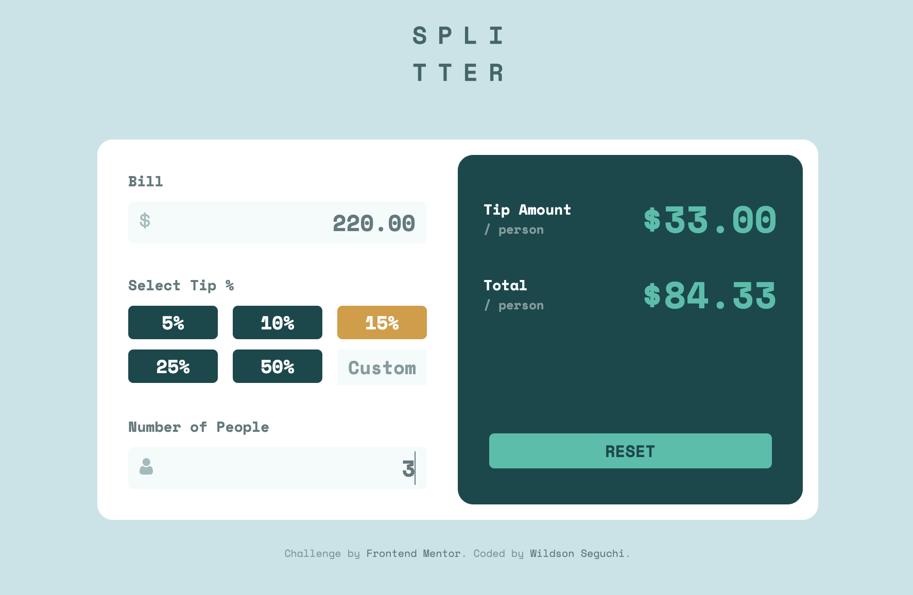

# SPLITTER - Tip Calculator App 

## Welcome / Bem vindo!

Thanks for checking out my front-end project. 
🇧🇷/🇵🇹 *Obrigado por conferir meu projeto de front-end.*

## Overview

Splittler is a WebApp that calculates the tip and total cost per person of a given bill. 
*Splitter é um aplicativo web que calcula a gorjeta e o valor total por pessoa de uma determinada conta.*

## Built with

- HTML5;
- CSS3;
- Java Script (Vanilla JS);
- Mobile-first workflow;

## Features

- Responsive design: support both desktop and mobile displays.
- CSS layout with flexbox.
- Input masks and validators with JS.

## Links

- Solution URL: [https://wseguchi.github.io/tip-calculator/](https://wseguchi.github.io/tip-calculator/)
- Github: [https://github.com/wseguchi/tip_calculator](https://github.com/wseguchi/tip_calculator)

## Author

- Wildson Seguchi
- [Github](https://github.com/wseguchi)
- [LinkedIn](https://www.linkedin.com/in/wildson-seguchi-a61325180/)

#### Frontend Mentor Challenge

This is a solution to the [Tip calculator app challenge on Frontend Mentor](https://www.frontendmentor.io/challenges/tip-calculator-app-ugJNGbJUX).
